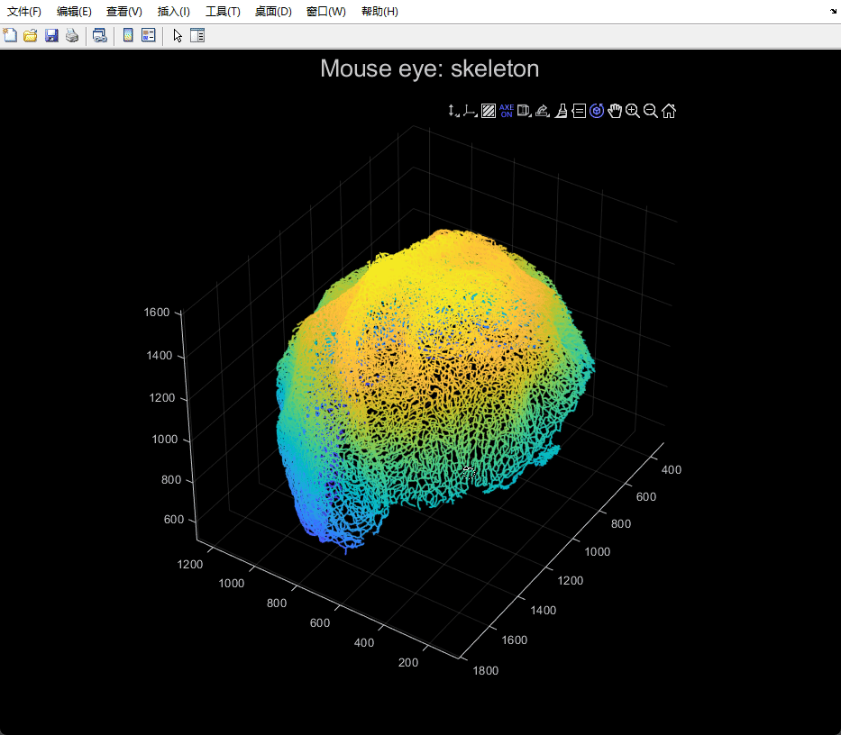
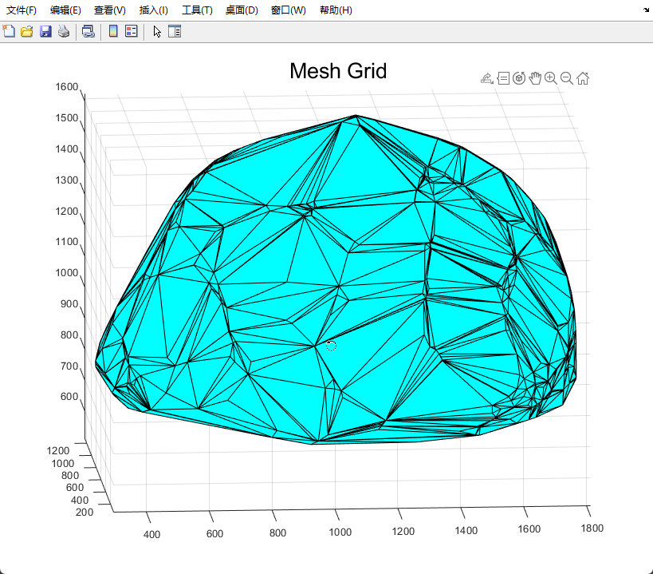
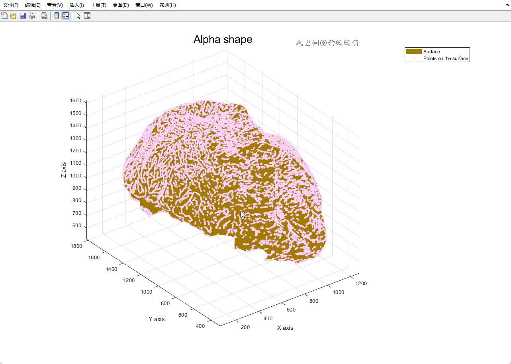
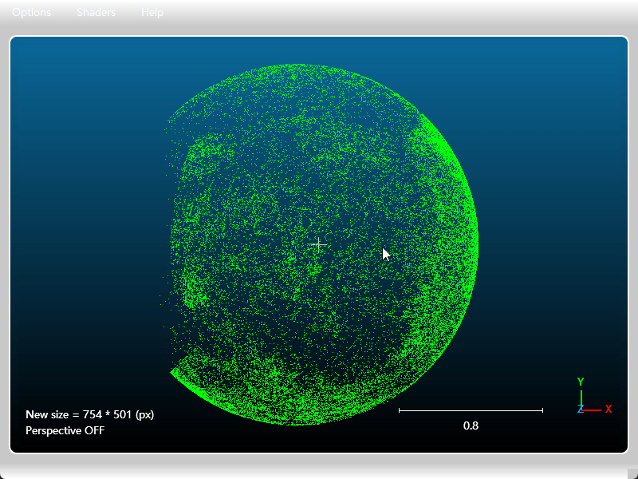
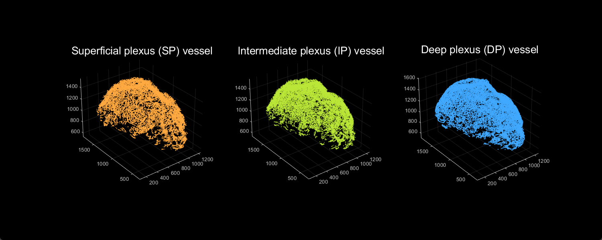
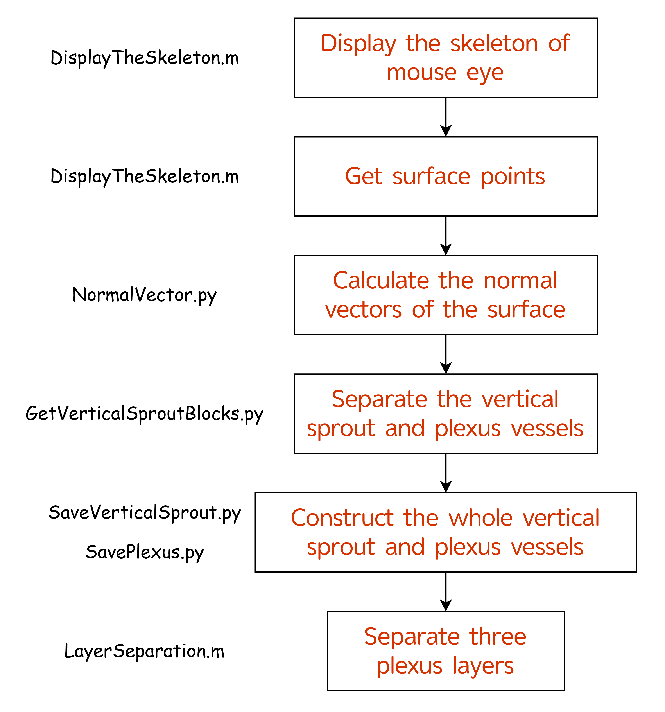

# README

## System Requirements

### Hardware Requirements

- **Memory (RAM)**: Minimum 32 GB required
- **Operating System**: Windows 10/11 (64-bit)

### Software Dependencies

This project requires both MATLAB and Python environments. Please note that the installation and configuration of the MATLAB software and the Python environment are expected to take approximately 2 to 3 hours in total. This estimate includes downloading, installing necessary packages, and setting up dependencies to ensure the project runs smoothly.

#### MATLAB

- **Version**: MATLAB R2023a or later

#### Python

- **Version**: Python 3.7.13

- **Required Package**
  requirements.txt
  
  ```
  numpy==1.20.2
  scikit-image==0.19.2
  scipy==1.6.1
  open3d==0.16.0
  ```

### Tested Configurations

The code has been tested on:

- Windows 11 Pro, Version 25H2 (OS Build 26200.7462, installed July 14, 2025)
- MATLAB R2023a
- Python 3.7.13 with Anaconda distribution


## Project Structure

The repository is organized into the following directories:

### Main Directories

```
DemoCode/
├── Data/                         # Stores intermediate process results and output files
├── Function/                     # Contains functions required for code execution
├── assets/                       # Stores README assets and supporting documentation materials
├── AlphaShape.m                  # MATLAB script for alpha shape algorithm
├── DisplayTheSkeleton.m          # MATLAB script for visualizing retinal vacular skeleton structures
├── GetVerticalSproutBlocks.py   # Python script for extracting vertical sprout blocks
├── LayerSeparation.m             # MATLAB script for separating plexus layers
├── NormalVector.py               # Python script for calculating normal vectors
├── requirements.txt              # Python environment dependencies specification
├── SavePlexus.py                 # Python script to save plexus vessel data
└── SaveVerticalSprout.py         # Python script to save vertical sprout vessel data

```

## fMOSS

### Step1 Skeletonization

The initial skeletonization of this codebase was adapted from the open-source implementation provided by Christoph Kirst et al. in their paper "Mapping the Fine-Scale Organization and Plasticity of the Brain Vasculature" (available at [ClearMap](https://github.com/ClearAnatomics/ClearMap)). We gratefully acknowledge their contribution to the community. The final skeleton of the retinal vascular is located in the `📂Data` folder, named `mouse_eye.tif`. Running the `DisplayTheSkeleton.m` script converts the tif data into 3D coordinates and displays it as a point cloud (saved as `📂Data/data_skeleton.mat`).  



### Step2 Direction separation

Run the `AlphaShape.m` script to extract surface points of retinal vascular using the `alpha shape` method. The surface after triangular meshing: 



The surface and points on the surface:



The 3D coordinates of surface points are saved as `📂Data/surface_points.mat`. The triangular mesh file of the surface is saved as `📂Data/surface.ply`, and the `.ply` file can be opened and viewed using `exocad view` or other software:


Run the `NormalVector.py` script to compute the surface normal vectors corresponding to surface points using the least squares method. The surface points are stored in `📂Data/surface_points.pcd`, and the surface normals are saved as `📂Data/surface_points_normal.pcd`. The `.pcd` files can be viewed using [ccViewer](https://www.cloudcompare.org/release/index.html) software. 



Run the `GetVerticalSproutBlocks.py` script to divide the entire retinal vascular skeleton into blocks. Then, calculate the principal axis direction of the vessels within each block via PCA, compute the angle with the previously determined surface normal vectors, and classify the vessel types accordingly. Note that this script may take a considerable amount of time to execute (about 2 h). Results saved as `📂Data/blk.npy` and `📂Data/blk.mat`. 

Run the `SaveVerticalSprout.py` script to obtain the entire vertical sprout vascular skeleton. Save it as `📂Data/vertical_sprout.tif`. To save storage space, you can convert it into a compressed file named `vertical_sprout.zip`. 
Run the `SavePlexus.py` script to acquire the entire Plexus vascular skeleton, saved as `📂Data/plexus.tif`. To save storage space, you can convert it into a compressed file named `plexus.zip`. 

All the `.tif` files can be viewed using [Iamris](https://imaris.oxinst.com/) or [Fiji](https://imagej.net/software/fiji/downloads) software. Note: If the computer has limited memory, please close Matlab or Python before viewing the tif file to free up sufficient memory.

### Step3 Layer separation

Run the `LayerSeparation.m` script to achieve layer separation using the GMM method. Note that this script may take a considerable amount of time to execute (about 2 h). 

At the end, the script will display and save the results of layer separation (`📂Data/class_plexus.mat`). 



## Pseudocode


